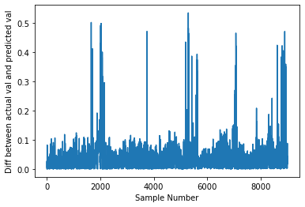
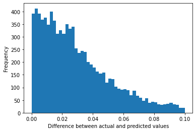
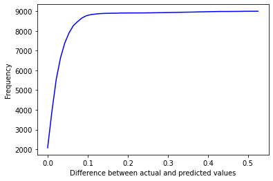

# Chess Neural Network Project

## Table of Contents
1. [Introduction](#introduction)
2. [Project Structure](#project-structure)
3. [Chess Engine](#chess-engine)
4. [Machine Learning](#machine-learning)
    1. [Introduction](#ml-introduction)
    2. [Training](#training)
    3. [Results](#results)
    4. [Testing](#testing)
    5. [Game Testing](#game-testing)
5. [Conclusion](#conclusion)
6. [References](#references)

## Introduction
This project aims to develop a chess engine that leverages machine learning, specifically neural networks, to evaluate chess positions. The goal was to create an AI that can compute the best move in a game, reducing the need for a human to think through all possible moves.

## Project Structure
The project was divided into two main parts: the chess engine and the neural network. The chess engine was responsible for generating legal moves, checking for checkmate/stalemate conditions, and other chess-related tasks. The neural network was used to evaluate the chess positions.

## Chess Engine
The chess engine was built using the python-chess library, which provides functions for managing a chess game. The engine includes an evaluation function that assigns scores to board positions, reflecting the strength of a player's position. The engine uses a Negamax variant of the MiniMax algorithm, which simplifies the process by calculating the evaluation value for one player and negating it for the other player. This results in a significant reduction in search time. To further improve the search time, alpha-beta pruning and quiescence search were implemented. Alpha-beta pruning reduces the number of nodes that the MiniMax algorithm needs to evaluate in its search tree, while quiescence search evaluates positions where there are moves to be made that could drastically increase the evaluation value.

## Machine Learning

### Introduction
The motivation behind using machine learning in this project was to overcome the computational challenges associated with evaluating hundreds of thousands of chess positions. The idea was inspired by a research paper that used multi-layered perceptrons for a Neural Net and trained it with regression and back-propagation.

The neural network used in this project consists of 3 hidden layers of a Multi-Layer Perceptron (MLP). The input layer consists of flattened input data, transforming the 8x8x12 array (representing the 64 chess squares and 6 different types of pieces for both black and white) into a single list of 768 numbers. The output layer for training the Neural Network has 1 unit as we are trying to approximate the output of Stockfish’s evaluation score.

### Training
The evaluation data was taken from Kaggle. The data consists of 'Chess Board Positions' in FEN format and evaluations for the position done by Stockfish AI with 22 depth search. The data was transformed into a 8x8x12 2D matrix array for the board-position representations for the input of the neural network. The y values (evaluation values) were normalized to be between 0 and +1 so that the predictive model can better approximate the y (evaluation) numbers given the chess board data.

### Results
On the first epoch, the model’s mean loss between the actual and predicted value was 0.0194 and a mean absolute error of 0.0918. After 200 epochs the loss was 0.0032 and the mean absolute error was 0.0397. This suggests that the NN model definitely learned to predict an evaluation value that was very close to the actual value. The highest difference between the predicted values and the actual values was 0.52. But 8694 samples out of 9000 (96.6%) had a difference of less than or equal to 0.1



Looking closely at the 8694 samples which resulted in <= 0.1 difference values, we can see that the majority of the difference values are very low in Fig (1). The graph tells us that there are more samples with lower difference values than there are for higher difference values.



For further analysis the cumulative function of the histogram below was computed, and from there we can see a sharp decline (pre-flattened) around 0.05 difference values 
and the curve starts to flatten out at 0.1.



We can assume most of the samples with higher difference values are from chess positions that consist of extreme cases such as “pinning a piece”, “multiple threats on a piece” which the NN doesn’t really account for.

### Testing
The NN model was evaluated through a test data set```markdown
which consisted of 10,000 random evaluations computed by Stockfish. The mean loss between the test evaluation values and the predicted evaluation values was 0.0030 and the mean absolute error was 0.0345. For each of the samples, the difference between the actual and the predicted value was calculated for further analysis. The data suggests that for any chess position the Neural Network model can output an evaluation value within 0.1 difference from the correct value with 95% accuracy.

### Game Testing
The NN was loaded into a chess game where it had to play against stockfish. The NN model played very good positional moves in the first 4 moves and started to play attacking moves after the 4th move when Stockfish started attacking with pawns. However, by the 8th move, the model started to lose against stockfish by playing losing moves.

## Conclusion
The results from the testing suggest that the NN model definitely learned through approximation as it was able to reduce the error down to very low. However, this model was only trained with the chess pieces positions, and analyzing the game of the NN vs Stockfish we can understand that it lacks understanding of “pieces under attack”, “pinned pieces”. Improvements can be made further on this NN model by training it under specific cases. Additional input of what piece was attacking what piece (chance to take a piece) will further improve the accuracy of the NN model when played in a real chess game. Specific chess positions can be used with increased learning rate to make the NN learn about some core ideas of chess strategy.

## References
1. Chess Programming Wiki heavily influenced my ideas and code for the chess engine.
2. “Chess History.” Britannica.
3. “Chess Evaluations”, Kaggle.
4. Playing Chess with limited look ahead.
5. Deep Learning Paper.
